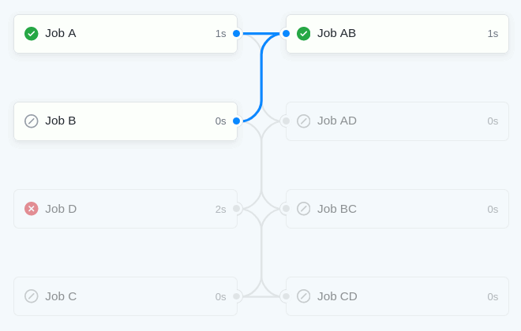

# Github workflow patterns

The goal of this repository is to document some common and/or useful pattern that can be implemented on Github workflows.

## One job to N jobs
N jobs wait on a single Job to succeed before proceeding.
[Example](.github/workflows/1-to-n.yml)

## N jobs to one jobs
In this case a single job is waiting on multiple jobs to succeed
[Example](.github/workflows/n-to-1.yml)

## Ignore skipped dependencies
It is possible to run a job one of it's dependencies fails
[Example](.github/workflows/ignore-skipped.yml)

